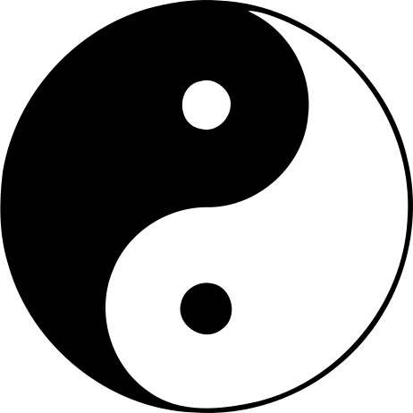

  Traditional Chinese Medicine (TCM) is an rich heritage and holistic healthcare system that has been practiced for thousands of years. Rooted in ancient Chinese philosophy, TCM provides an unique view on health, focusing on the balance between Yin and Yang in the body.

 

  Ancient Chinese medicine has a long history dating back thousands of years. Early Chinese people discovered that certain herbs could help treat various illnesses and promote health. Over time, they developed a systematic approach to healthcare by organizing herbs and treatments into what we now know as Traditional Chinese Medicine (TCM).

 

 The most important concepts in TCM are balance and harmony. According to TCM philosophy, the body is a microcosm of the universe, and health is maintained when there is a harmonious balance between opposing forces known as Yin and Yang. Yin and Yang are abstract concepts in Traditional Chinese Medicine. Yin includes the cold, deficiency, and feminine aspects, while Yang includes the hot, excess, and masculine aspects. An imbalance of any aspects in Yin and Yang can lead to illness. Understanding and restoring the balance of Yin and Yang is central to the practice of Traditional Chinese Medicine, guiding diagnosis, treatment, and the promotion of overall well-being.

In TCM, there are different parts like Acupuncture, Herbal Medicine, and Tai Chi. At HerbCaring, our main focus is on Herbal Medicine. We're dedicated to offer exceptional herbal formulas to promote your overall well-being.

 

  Connect with HerbCaring on our social media platforms –
  <a href="https://www.facebook.com/herbcaring" target="_blank">
    <u>Facebook</u>
  </a>
  ,<a href="https://www.instagram.com/herbcaring/" target="_blank">
    <u>Instagram</u>
  </a>,<a href="https://www.tiktok.com/@herbcaring" target="_blank">
    <u>TikTok</u>
  </a>,<a href="https://twitter.com/HerbCaring" target="_blank">
    <u>Twitter</u>
  </a>, deeper into the world of TCM and our innovative products. Join us in embracing
  the natural approach to wellness with HerbCaring – where tradition meets innovation
  for your well-being.

 

  <b>Disclaimer</b>: Please note that while Traditional Chinese Medicine (TCM)
  has been practiced for centuries and may offer benefits for some individuals,
  the information provided in this article is for educational purposes only. It
  should not be construed as medical advice or a substitute for professional
  healthcare consultation. Consult with a qualified healthcare practitioner or
  licensed TCM specialist for personalized guidance and treatment for your
  individual needs and circumstances.

