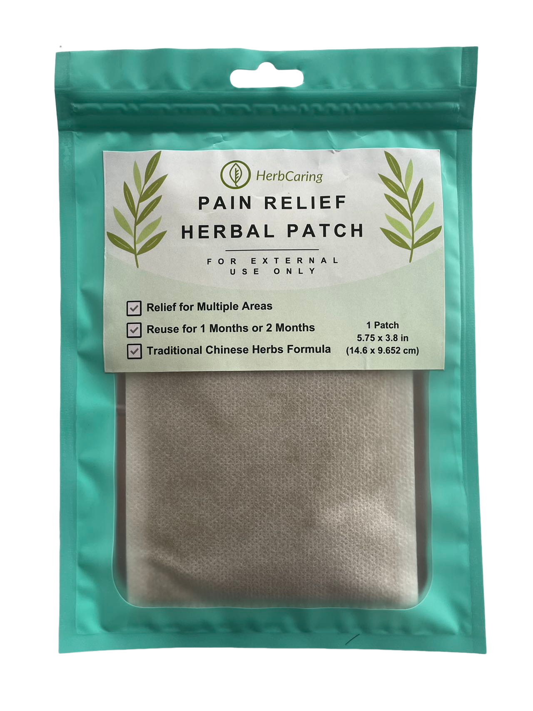

  🌿 Introducing our first product, the Pain Relief Herbal Patch! 🌟 Crafted
  using traditional Chinese herbs and a premium herbal formula, our Pain Relief
  Herbal Patch offers a natural solution to a variety of pains to improve your
  quality of life. Loved by the locals and now available online for all to
  enjoy!
  <a
    href="https://www.amazon.com/dp/B0CW11FXN1?ref=myi_title_dp"
    target="_blank"
  >
    <u> Amazon link </u>
  </a>

  Our patches provide long-lasting relief for various pains caused by arthritis,
  strain and sprain, sciatica, fibromyalgia, tenosynovitis, menstrual cramps,
  and more. Versatile in application, they effectively target back, neck, joint,
  shoulder, muscle pain, and even aid with stomach pain and acid reflux. Plus,
  each single patch is reusable for 1 to 2 months, ensuring lasting relief and
  value.

 

  To celebrate our launch, we're offering 20% off until Feb 26th. Guarantee
  refund if you are not satisfied. Don't miss out—get your relief today and
  embrace the natural approach to wellness with HerbCaring. 🌱

 

  Connect with HerbCaring on our social media platforms –
  <a href="https://www.facebook.com/herbcaring" target="_blank">
    <u>Facebook</u>
  </a>
  ,<a href="https://www.instagram.com/herbcaring/" target="_blank">
    <u>Instagram</u>
  </a>,<a href="https://www.tiktok.com/@herbcaring" target="_blank">
    <u>TikTok</u>
  </a>,<a href="https://twitter.com/HerbCaring" target="_blank">
    <u>Twitter</u>
  </a>, deeper into the world of TCM and our innovative products. Join us in embracing
  the natural approach to wellness with HerbCaring – where tradition meets innovation
  for your well-being.

